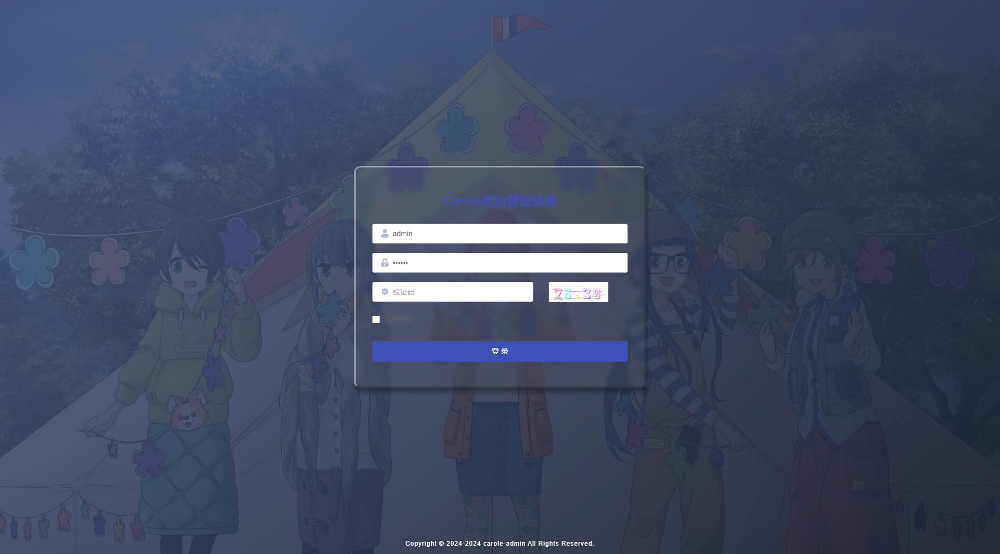
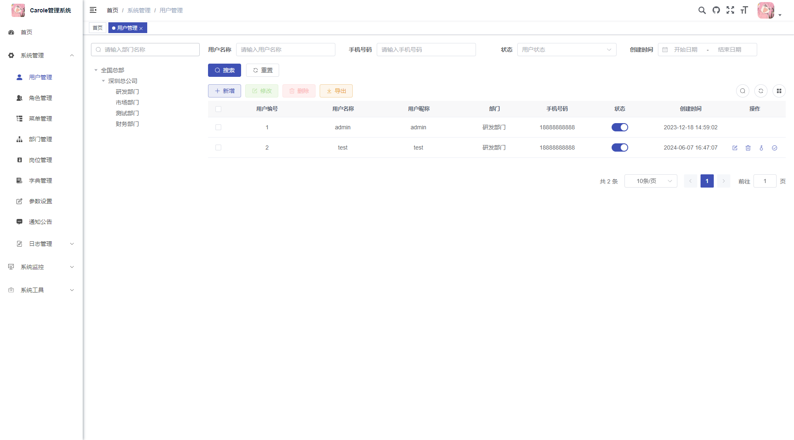
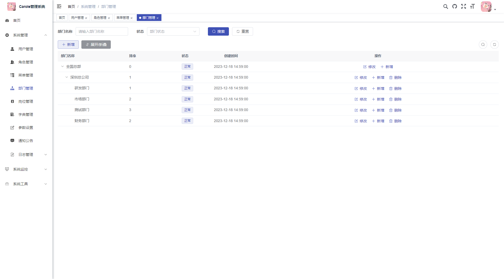
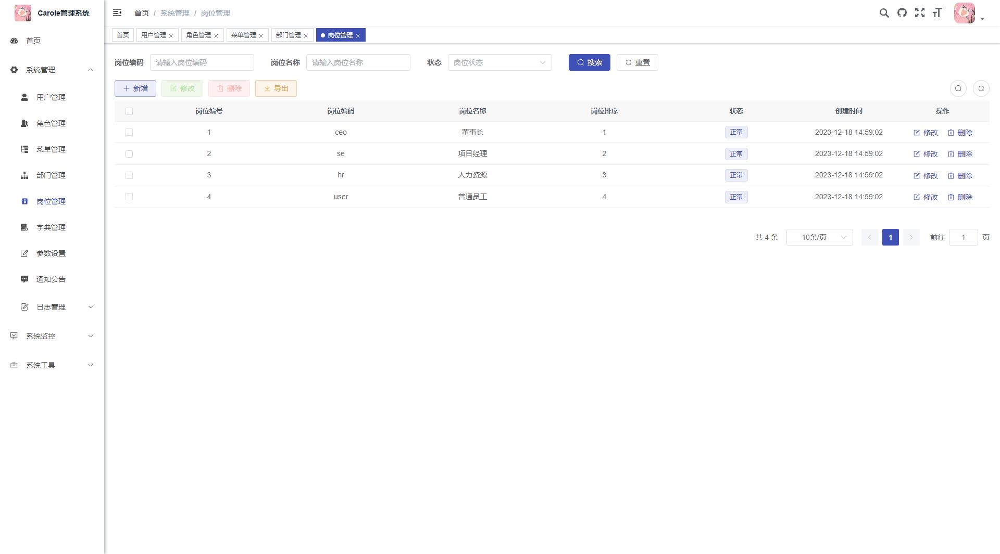
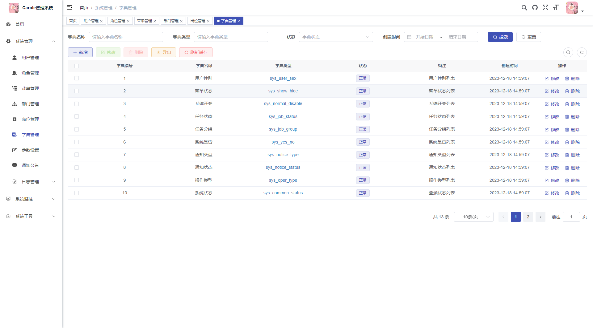
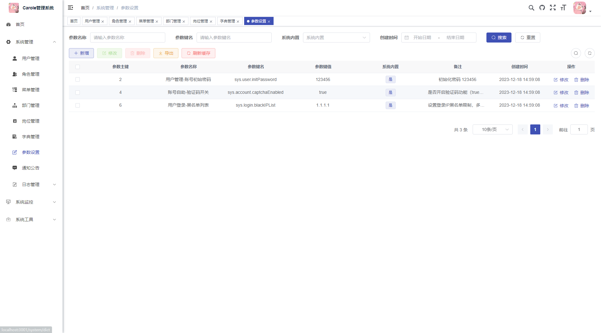
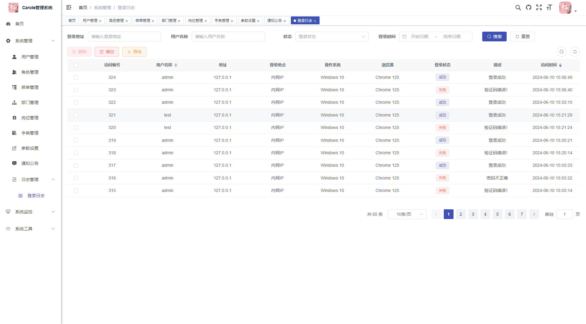
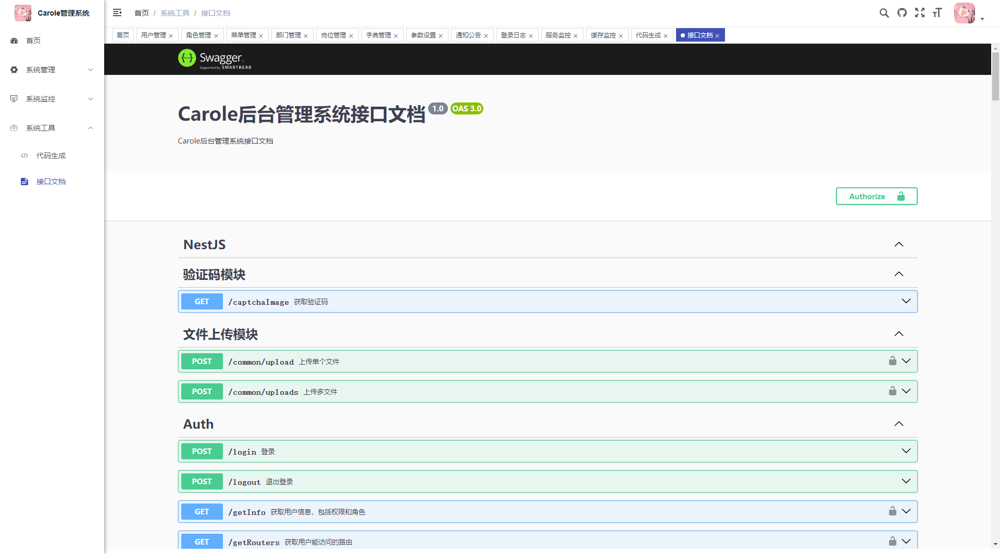
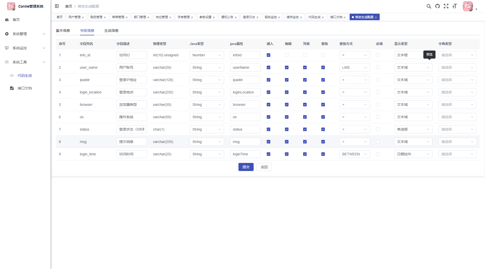
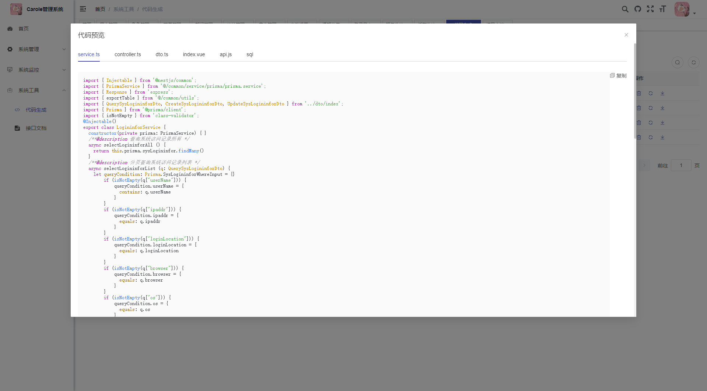

<div  align="center">
 
 <h1 >Carole-Admin</h1>
    <h3 >一款基于 Nestjs+Vue前后端分离的后台框架</h3>
</div>

# 介绍

## 平台简介

`carole-admin` 是一款[Nestjs](https://nestjs.com/)+[Prisma](https://www.prisma.io/)+[Vue](https://vuejs.org/)+[Vite](https://vitejs.dev/)前后端分离的全栈快速开发平台, 前端基于[若依](https://github.com/yangzongzhuan/RuoYi-Vue3)。

- 前端采用[Vue3](https://vuejs.org/)、[Element-Plus](https://element-plus.org/)、[Vite](https://vitejs.dev/)。
- 后端采用[Nest](https://nestjs.com/)、[Prisma](https://www.prisma.io/)、[ioredis](https://github.com/redis/ioredis) & [Jwt](https://github.com/auth0/node-jsonwebtoken)。
- 权限认证使用[Jwt](https://github.com/auth0/node-jsonwebtoken)，支持多终端认证系统。
- 支持加载动态权限菜单，多方式轻松权限控制。
- 支持接口限流
- 高效率开发，使用代码生成器可以一键生成前后端代码。

## 项目

> 演示地址：[https://carole-admin-demo.carole.top](https://carole-admin-demo.carole.top)
>
> 默认有两个用户： admin的密码为carole test的密码为123456
>
> github: <https://github.com/Carole007/carole-admin>
>

## 内置功能

1. 用户管理：用户是系统操作者，该功能主要完成系统用户配置。

2. 部门管理：配置系统组织机构。

3. 岗位管理：配置系统用户所属担任职务。

4. 菜单管理：配置系统菜单，操作权限，按钮权限标识等。

5. 角色管理：角色菜单权限分配、设置角色按机构进行数据范围权限划分。

6. 字典管理：对系统中经常使用的一些较为固定的数据进行维护。

7. 参数管理：对系统动态配置常用参数。

8. 通知公告：系统通知公告信息发布维护。

9. 登录日志：系统登录日志记录查询包含登录异常。

10. 代码生成：前后端代码的生成（js、vue、sql）支持CRUD下载 。

11. 系统接口：根据业务代码自动生成相关的api接口文档。

12. 在线用户：当前系统中活跃用户状态监控。

13. 服务监控：监视当前系统CPU、内存、磁盘、堆栈等相关信息。

14. 缓存监控：对系统的缓存信息查询，命令统计等。

## 演示图

|  |  |
| ------------------------------------------------------------ | ------------------------------------------------------------ |
|  |  |
|  |  |
|  |  |
|  |  |
|  |  |
|  |  |
|  |  |
|                                                              |                                                              |

# 文档

## 主要文件结构

```
 server   #系统后端
 front    #系统前端
 server/src目录
           ├─admin                 #系统管理模块
           │  ├─gen                #代码生成
           │  └─system             #系统代码
           │  └─admin.module.ts    #系统模块配置
           
           ├─common                #工具类 
           │  ├─decorator          #自定义注解    
           │  ├─filter             #异常处理 
           │  ├─guard
           │  │  ├─permission      #权限校验 
           │  ├─middleware         #中间件
           │  │  └─auth        #身份校验 
           │  ├─pipe         #自定义管道
           │  ├─prisma-client     #prisma客户端
           │  ├─result         #返回对象
           │  ├─service
           │  │  ├─auth            #身份相关处理逻辑
           │  │  ├─gen         #代码生成逻辑
           │  │  │  └─gen-template #代码模板
           │  └─utils         #通用工具
           
           ├─prisma
           │  └─schema        #数据库模型定义
           │  └─schema.prisma      #prisma主文件
           
           ├─schedule         #定时任务
           
           ├─.env            #环境变量配置， 密码
           ├─main.ts               #主文件
           ├─config.ts             #系统配置文件
           ├─config-production.json   #系统生产配置文件
           ├─config-development.json   #系统开发配置文件
           ├─app.module.ts         #系统主模块
```

## 开发指南

详细的开发指南请参考以下文档：

- [安装指南](install.md) - 安装使用详解
- [配置说明](config.md) - 系统配置文件详解
- [开发指南](guide.md) - 包含权限控制、Prisma使用、代码生成等详细说明
- [常见问题](faq.md) - 常见问题解答

## 部署指南

关于如何部署系统，请参考[部署指南](guide.md?id=部署)。
