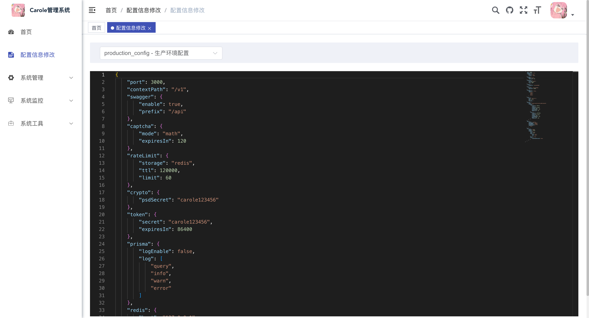

## ⚙️ 配置说明

> ⚠️ **重要说明**  
   如果 JSON 配置文件中存在 `Config` 里的 配置项，它将覆盖默认的 `Config` 对象对应的键值，请修改对应JSON文件确保配置生效！  

- 修改时请遵循开发环境优先，编辑对应的开发或生产 JSON 文件。  
- 如果 JSON 文件中未包含某个 key，则该 key 的值将使用 `config.ts` 中的默认配置。

**Carole-Admin** 的配置主要分为两部分：

1. **主配置文件**  
   文件路径：`server/src/config.ts`

   - 包含系统的主要配置项。
   - 对应的 `config-development.json` 和 `config-production.json` 文件分别用于开发环境和生产环境配置。
   - 可在 `config.ts` 中修改：

     ```ts
     const runMode: 'development' | 'production' = 'development'
     ```

     用于加载对应的配置文件，并覆盖 `Config` 对象的内容。

2. **环境变量文件**  
   文件路径：`server/src/.env`
   - 包含数据库连接信息、以及自定义一些私密参数。

## 主配置文件详解

`config.ts` 文件包含了系统的大部分配置项，下面是各配置项的详细说明：

```typescript
import * as dotenv from 'dotenv'
import { join } from 'path'
import { watch } from 'fs'
import { readJsonFile } from './common/utils'
dotenv.config({ path: join(__dirname, `.env`) })
//运行模式，根据不同的模式加载不同的配置文件 development=>开发环境  production=>生产环境
export let runMode: 'development' | 'production' = 'development'
const config_file_path = join(__dirname, `config-${runMode}.json`)

/* 根据运行模式加载文件后，会覆盖默认配置
可直接修改对应的json文件  config-${runMode}.json  或者删除json文件中对应的key，默认就使用下面的配置。
后台提供了默认的配置文件修改，Config也会自动加载修改后的配置。 */
export const Config = {
  //服务器的HTTP端口，默认为3000
  port: 3000,
  //# 应用的访问路径前缀
  contextPath: '/v1',
  swagger: {
    //是否启用swagger
    enable: true,
    //接口文档路径
    prefix: '/api'
  },
  captcha: {
    //验证码类型 math或text
    mode: 'math',
    //验证码过期时间
    expiresIn: 60 * 2
  },
  //配置文件列表,管理后台可快捷编辑同步Config数据  注意：开发环境运行在dist目录，修改的也是dist里面的配置文件
  //根据业务可能会有多个配置文件
  ConfigFileMap: {
    production_config: {
      desc: '生产环境配置',
      filePath: join(__dirname, './config-production.json')
    },
    dev_config: {
      desc: '开发环境配置',
      filePath: join(__dirname, './config-production.json')
    }
  },
  //接口限流 2分钟内同一个接口允许60次请求
  rateLimit: {
    //数据存储在redis or memory
    storage: 'redis',
    ttl: 2 * 60 * 1000,
    limit: 60
  },
  crypto: {
    //密码加密秘钥
    psdSecret: 'carole123456'
  },
  token: {
    // token加密秘钥
    secret: 'carole123456',
    //过期时间秒
    expiresIn: 60 * 60 * 24
  },
  prisma: {
    //是否显示执行的sql指令
    logEnable: false,
    //显示那些日志
    log: ['query', 'info', 'warn', 'error'] as any
  },
  //redis连接配置
  redis: {
    //主机地址
    host: '127.0.0.1',
    //端口
    port: 6379,
    //数据库
    db: 5,
    //密码
    password: ''
  },
  upload: {
    //上传文件存储基目录 请设置一个绝对路径
    path: join(__dirname, 'uploads'),
    config: {
      img: {
        fileSize: 2 * 1024 * 1024,
        files: 1,
        fieldSize: 0.5 * 1024 * 1024,
        fields: 100,
        fieldNameSize: 100,
        parts: 100,
        headerPairs: 100
      },
      file: {
        fileSize: 100 * 1024 * 1024,
        files: 10,
        fieldSize: 0.5 * 1024 * 1024,
        fields: 100,
        fieldNameSize: 100,
        parts: 100,
        headerPairs: 100
      }
    }
  },
  //生成配置
  gen: {
    //作者
    author: 'carole',
    //默认生成模块
    packageName: 'admin',
    //子模块目录
    moduleName: 'system',
    //是否去除表前缀，默认是false
    autoRemovePre: false,
    //表前缀（生成类名不会包含表前缀，多个用逗号分隔）
    tablePrefix: ['sys_']
  },
  //邮件发送配置
  mail: {
    //是否启用邮箱
    enable: false,
    //超时设置， 30秒未发送邮件，则返回失败
    timeout: 30 * 1000,
    config: {
      //邮箱服务器 qq：smtp.qq.com 网易： smtp.163.com
      host: '',
      //端口
      port: 465,
      auth: {
        //用户名
        user: '',
        //密码
        pass: ''
      },
      // 端口465设置true, 其他false
      secure: true,
      tls: {
        //建立 TLS 连接时是否应该拒绝未经授权的服务器证书
        rejectUnauthorized: false
      }
    }
  }
}
initConfig()
export function initConfig() {
  let data = readJsonFile(config_file_path)
  if (data) {
    for (let k in data) {
      Config[k] = data[k]
    }
  }
}
// 监听config文件变化
watch(config_file_path, (eventType, filename) => {
  if (eventType === 'change') {
    try {
      initConfig()
      console.log('config已更新')
    } catch (err) {
      console.log('更新config失败:', err)
    }
  }
})
//是否开发环境
export function isDevelopment() {
  return runMode === 'development'
}
//是否生产环境
export function isProduction() {
  return runMode === 'production'
}
```

## 后台修改配置


